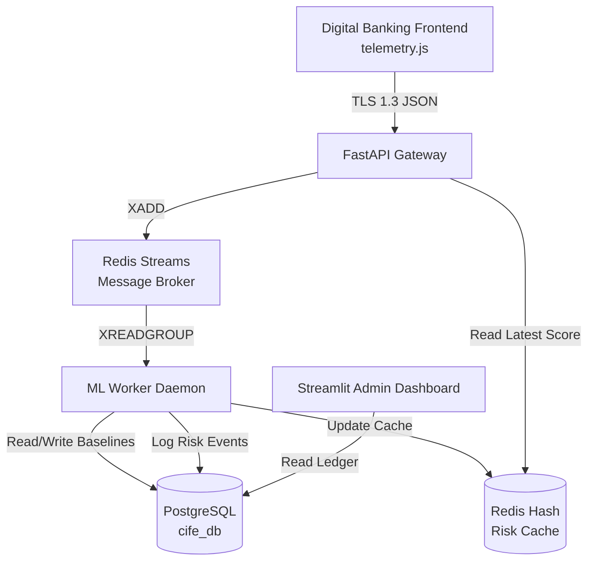

# Contextual Identity Fusion Engine (CIFE) - Architecture

## System Overview
CIFE is a privacy-first, risk-based Identity Trust framework that continuously validates customer and enterprise identities across digital channels. It detects high-risk events (anomalous behavior, device spoofing, account takeover) and triggers real-time step-up verification ONLY when risk levels are elevated.

## Core Microservices Architecture

CIFE uses a decoupled, event-driven architecture designed to minimize latency on the critical path (API ingestion) while allowing heavy statistical ML processing to occur asynchronously in the background.

### 1. Telemetry Engine (`frontend_banking_mock/public/telemetry.js`)
* **Role**: Lightweight JS snippet embedded in the bank's frontend.
* **Function**: Tracks keystroke dynamics (hold/flight times), mouse movement (velocity/curvature), scrolling patterns, and extracts browser device fingerprints (Canvas/WebGL hashes).
* **Collection Frequency**: Passive collection every 30 seconds to respect battery/privacy, combined with immediate event-triggered collection on critical actions (Login, Fund Transfer).

### 2. API Ingestion Gateway (`api_gateway/`)
* **Role**: High-throughput FastAPI service.
* **Function**: Validates incoming telemetry via strict Pydantic schemas. Performs ZERO ML computation. It simply validates the payload and pushes it onto a Redis Stream queue.
* **Latency**: <5ms response time.

### 3. ML Worker Daemon (`ml_worker_daemon/`)
* **Role**: The brain of the system.
* **Function**: Polls Redis Streams for new telemetry payloads.
* **Pipeline**:
  1. Fetches the user's historical EWMA baseline from PostgreSQL.
  2. Computes the **Behavioral Score** using Z-score math.
  3. Computes the **Device Score** using Weighted Jaccard Similarity.
  4. Fuses scores into a **Composite Risk Score (CRS)** between 0-100.
  5. Evaluates the CRS against the configured **Risk Policy**.
  6. Updates the baseline in PostgreSQL (only if the session is not flagged as high-risk).
  7. Caches the latest risk assessment in Redis for rapid API access.

### 4. Admin Dashboard (`admin_dashboard/`)
* **Role**: Visual command center for fraud analysts.
* **Function**: Built with Streamlit and Plotly. Queries PostgreSQL to display real-time risk heatmaps, session timelines showing behavioral vs device risk evolution, and a device registry trust manager.

## Data Flow: The Lifecycle of a Keystroke
1. User types their password. `telemetry.js` records the hold time and flight time.
2. The payload is sent to the API Gateway via POST.
3. API Gateway validates it and runs `XADD telemetry_stream * payload`.
4. ML Worker reads the stream, calculates that the typing rhythm is 3.5 standard deviations away from the user's normal baseline (Z=3.5).
5. The Behavioral Score spikes. The Fusion Engine weights this heavily.
6. The Policy Engine sees CRS=72 (HIGH risk).
7. Action is set to `CHALLENGE_HARD`.
8. The frontend, polling the risk API, sees the HIGH risk flag and intercepts the login request, forcing an SMS OTP.
