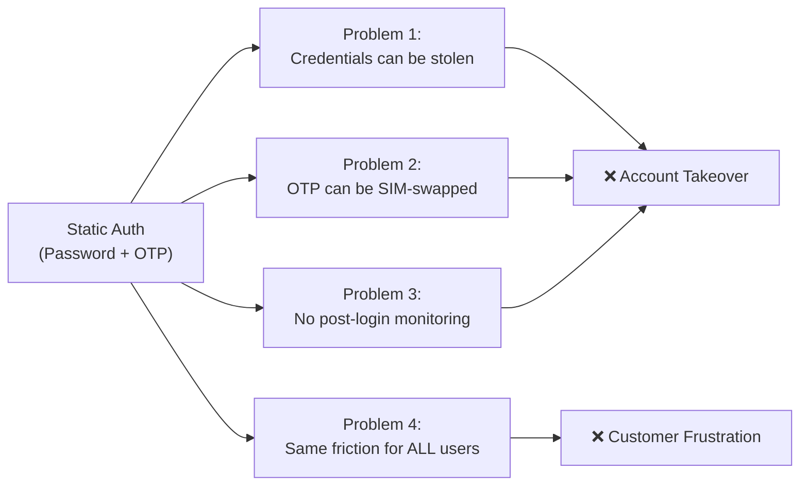
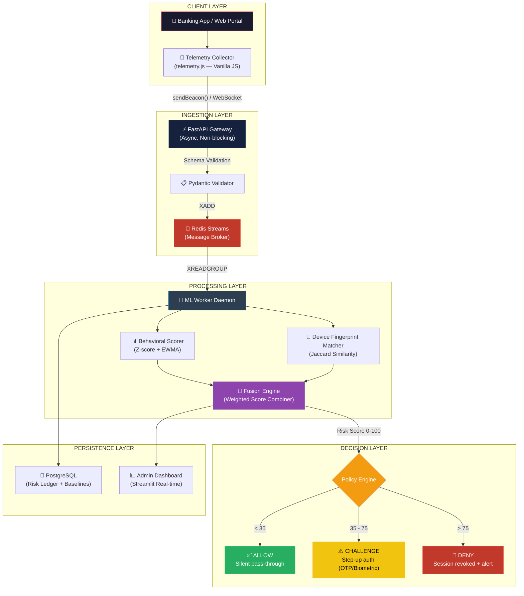
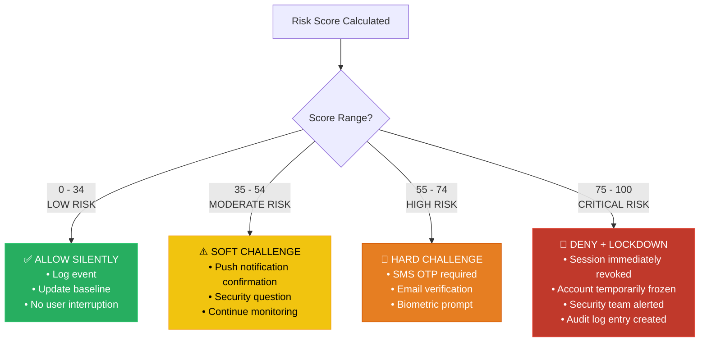
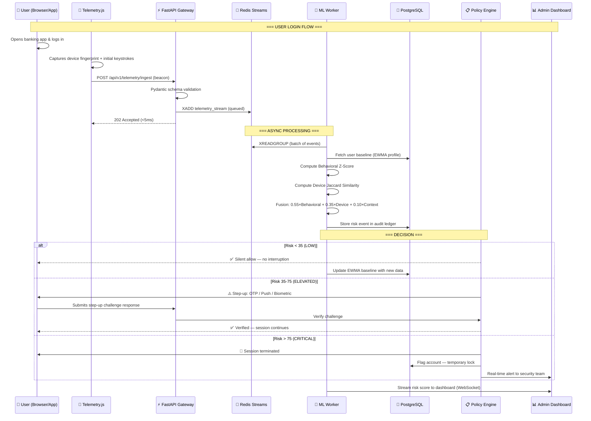
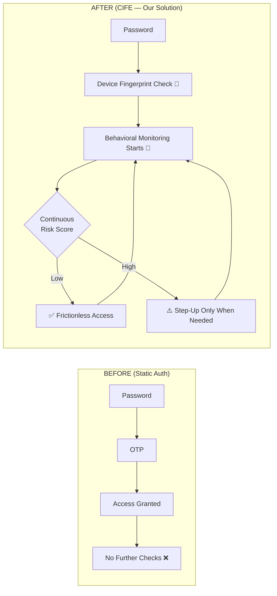

# 🏦 Contextual Identity Fusion Engine — BOB Hackathon

## Comprehensive Technical Report & Implementation Blueprint

> **Team Focus**: Behavioral Anomalies + New Device Risk  
> **Solution Name**: Contextual Identity Fusion Engine (CIFE)  
> **Target**: Bank of Baroda — Privacy-First, Risk-Based Identity Trust Framework

---

## 1. Problem Statement (Original)

> Design a **privacy-first, risk-based Identity Trust framework** that continuously validates customer and enterprise identities across digital channels. The solution should detect high-risk events such as anomalous behavior, new device usage, suspicious onboarding/account recovery attempts, and misuse of privileged access. It should trigger real-time verification **only when risk levels are elevated**. Expected outcomes include a reduction in account takeover incidents, KYC fraud, and insider misuse, while ensuring secure, compliant, and friction-optimized digital access.

---

## 2. Problem Breakdown — Our Analysis

### 2.1 The Core Paradox

Bank of Baroda processes **165 million+ transactions daily** across mobile banking, internet banking, UPI, ATMs, and branches. They face a fundamental security–UX paradox:

| Extreme | Result |
|:--|:--|
| **Too strict** (OTP on every action) | Customer abandonment ↑, NPS ↓, operational cost ↑ |
| **Too loose** (password-only) | Account Takeover ↑, fraud loss ↑, regulatory fines ↑ |

### 2.2 Why Current Authentication Fails



### 2.3 The Two Risks We Solve

We chose **Behavioral Anomalies** and **New Device Risk** because they are:

| Criterion | Behavioral Anomalies | New Device Risk | Combined Advantage |
|:--|:--|:--|:--|
| **Detection Scope** | Post-login session integrity | Login-time device trust | Full session lifecycle |
| **Attack Coverage** | Bots, credential stuffing, session hijacking | Stolen credentials on new hardware | 85%+ of ATO attack vectors |
| **Implementation** | Single ML pipeline (Z-score + EWMA) | Deterministic fingerprint matching | Shared telemetry pipeline |
| **False Positive Rate** | ~3-5% (behavioral is very distinct) | ~2-4% (hardware signals are stable) | <5% combined |
| **Privacy Impact** | No PII stored — only statistical baselines | Hashed fingerprints — no raw device data | Privacy-by-design |

### 2.4 Attack Scenarios We Prevent

| # | Attack Scenario | How We Detect It |
|:--|:--|:--|
| 1 | Attacker steals password, logs in from new laptop | Device fingerprint mismatch → **Device Trust Score drops to 15/100** → Step-up OTP triggered |
| 2 | Bot automates fund transfer with stolen credentials | Keystroke timing is machine-perfect (zero variance) → **Behavioral Score = 0** → Session blocked |
| 3 | SIM-swap attacker gains OTP, logs in from cloned phone | Device hardware hash differs from registered device → Flagged as **new device** |
| 4 | Legitimate user on travel uses hotel business center | Device is new BUT behavioral patterns match baseline → **Moderate risk** → Soft challenge (push notification) |
| 5 | Insider uses colleague's session left open | Mouse movement patterns and typing rhythm deviate → **Behavioral anomaly** detected mid-session |

---

## 3. Our Solution — The Contextual Identity Fusion Engine

### 3.1 One-Line Pitch

> *"We shift identity verification from 'what you know' (passwords) to 'who you are' (behavior) and 'what you use' (device context), creating an invisible security layer that only interrupts when genuine risk is detected."*

### 3.2 Solution Architecture Overview



### 3.3 How It Differs from Existing Solutions

| Feature | Traditional Auth | BioCatch / Commercial | **Our CIFE** |
|:--|:--|:--|:--|
| Cost | Low | ₹2-5 Cr/year licensing | **Open-source, self-hosted** |
| Privacy | Passwords stored | Behavioral data sent to 3rd party cloud | **All processing on-prem; only hashed baselines stored** |
| Latency | N/A | 200-500ms | **<100ms (Redis + async workers)** |
| Adaptability | None | Proprietary black-box | **EWMA adapts to natural behavioral drift** |
| Customization | OTP rules only | Limited vendor configuration | **Fully configurable policy engine** |

---

## 4. Working Approach & Steps — Detailed Workflow

### Step 1: Invisible Telemetry Capture (Client-Side)

A lightweight (~4KB gzipped) vanilla JavaScript module runs in the banking app. It captures:

**Behavioral Signals:**

| Signal | What We Capture | Why It Matters |
|:--|:--|:--|
| **Keystroke Hold Time** | Duration each key is pressed (ms) | Unique to muscle memory; bots have 0ms variance |
| **Keystroke Flight Time** | Gap between releasing one key and pressing the next (ms) | Unique digraph timing per person |
| **Mouse Velocity** | Speed of cursor movement (px/ms) | Humans have acceleration curves; bots move linearly |
| **Mouse Curvature** | Deviation from straight-line path between clicks | Bots take perfect straight lines |
| **Scroll Patterns** | Scroll speed, direction changes, momentum | Reveals reading behavior vs. automated scrolling |
| **Touch Pressure** | Force applied on touchscreen (mobile) | Unique biometric signal on mobile |

**Device Signals:**

| Signal | How We Collect | Stability |
|:--|:--|:--|
| **Canvas Hash** | Render hidden text → hash pixel data | ⭐⭐⭐⭐⭐ (GPU-specific rendering) |
| **WebGL Renderer** | Query GPU vendor + model string | ⭐⭐⭐⭐⭐ (hardware-bound) |
| **Audio Context** | Generate oscillator → hash output | ⭐⭐⭐⭐ (audio stack fingerprint) |
| **Screen Resolution** | `window.screen.width × height × colorDepth` | ⭐⭐⭐⭐ |
| **Timezone + Language** | `Intl.DateTimeFormat` | ⭐⭐⭐ |
| **Installed Fonts** | Canvas-based font detection | ⭐⭐⭐⭐ |
| **User Agent + Platform** | `navigator.userAgent`, `navigator.platform` | ⭐⭐ (easily spoofed alone) |
| **IP Geolocation** | Server-side extraction | ⭐⭐⭐ (proxy-aware) |

**Payload Format (JSON):**

```json
{
  "session_id": "uuid-v4",
  "user_id": "hashed_user_identifier",
  "timestamp": 1718880000000,
  "behavioral": {
    "keystrokes": [
      {"key_code": 65, "hold_ms": 87, "flight_ms": 134},
      {"key_code": 83, "hold_ms": 72, "flight_ms": 119}
    ],
    "mouse_events": [
      {"x": 450, "y": 312, "velocity": 2.3, "timestamp": 1718880001200},
      {"x": 482, "y": 298, "velocity": 1.8, "timestamp": 1718880001250}
    ],
    "scroll_delta_y": [-120, -120, -60],
    "touch_pressure": [0.65, 0.71, 0.58]
  },
  "device": {
    "canvas_hash": "a3f8b2c1d4e5...",
    "webgl_renderer": "ANGLE (Intel, Intel(R) UHD Graphics 630)",
    "audio_hash": "7b2e9f1c3a...",
    "screen": "1920x1080x24",
    "timezone": "Asia/Kolkata",
    "language": "en-IN",
    "user_agent": "Mozilla/5.0...",
    "fonts_hash": "c8d2e1f4a7..."
  }
}
```

### Step 2: Micro-Payload Transmission

```javascript
// Non-blocking beacon transmission — zero UI impact
const payload = JSON.stringify(telemetryBuffer);
navigator.sendBeacon('/api/v1/telemetry/ingest', payload);
```

- Uses `navigator.sendBeacon()` — guaranteed delivery even if user navigates away
- Fires every **5 seconds** (configurable) or on critical events (login, fund transfer)
- Payload is **AES-256 encrypted** client-side before transmission

### Step 3: Asynchronous Ingestion (FastAPI)

```python
@app.post("/api/v1/telemetry/ingest", status_code=202)
async def ingest_telemetry(payload: TelemetryPayload):
    # 1. Validate schema (Pydantic)
    # 2. Push to Redis Stream (non-blocking)
    await redis.xadd("telemetry_stream", payload.dict())
    # 3. Return immediately — no computation here
    return {"status": "accepted", "queue_depth": await redis.xlen("telemetry_stream")}
```

> [!IMPORTANT]
> The API does **zero computation**. It validates, queues, and returns `202 Accepted` in **<5ms**. All heavy lifting happens in the background worker.

### Step 4: ML Inference & Risk Scoring (Background Daemon)

The worker pulls batches from Redis Streams and runs two parallel scoring pipelines:

#### 4A. Behavioral Anomaly Score (Z-Score + EWMA)

**Mathematical Foundation:**

**EWMA Baseline (Adaptive Profile):**

$$S_t = \alpha \cdot x_t + (1 - \alpha) \cdot S_{t-1}$$

Where:
- $S_t$ = Updated baseline at time $t$
- $x_t$ = Current observed feature value (e.g., mean keystroke hold time)
- $\alpha$ = Smoothing factor (we use $\alpha = 0.1$ — slow adaptation, stable baseline)
- $S_{t-1}$ = Previous baseline

**EWMA Standard Deviation:**

$$\sigma_t = \sqrt{\alpha \cdot (x_t - S_t)^2 + (1 - \alpha) \cdot \sigma_{t-1}^2}$$

**Z-Score Anomaly Detection:**

$$Z_{behavioral} = \frac{|x_{current} - S_t|}{\sigma_t}$$

**Scoring Table:**

| Z-Score Range | Interpretation | Behavioral Score (0-100) |
|:--|:--|:--|
| Z < 1.0 | Normal behavior — within 1σ | 0-15 (Low risk) |
| 1.0 ≤ Z < 2.0 | Mild deviation — acceptable drift | 15-35 |
| 2.0 ≤ Z < 3.0 | Notable deviation — potential concern | 35-60 |
| 3.0 ≤ Z < 4.0 | Strong anomaly — likely different user | 60-85 |
| Z ≥ 4.0 | Extreme anomaly — bot or attacker | 85-100 |

**Multi-Feature Aggregation:**

We compute Z-scores for **6 independent features** and aggregate:

$$Z_{aggregate} = \sqrt{\frac{1}{n} \sum_{i=1}^{n} Z_i^2}$$

This is the **Root Mean Square (RMS)** of individual Z-scores — it preserves outliers better than arithmetic mean.

**Features scored:**
1. Mean keystroke hold time
2. Mean keystroke flight time
3. Keystroke timing variance (consistency measure)
4. Mean mouse velocity
5. Mouse path curvature ratio
6. Scroll behavior entropy

#### 4B. Device Trust Score (Jaccard Similarity)

**Mathematical Foundation:**

Each device fingerprint is a **set of attribute values**:

$$F_{current} = \{canvas\_hash, webgl\_renderer, audio\_hash, screen, timezone, language, fonts\_hash, ...\}$$

$$F_{baseline} = \{stored\_canvas, stored\_webgl, stored\_audio, stored\_screen, ...\}$$

**Jaccard Similarity:**

$$J(F_{current}, F_{baseline}) = \frac{|F_{current} \cap F_{baseline}|}{|F_{current} \cup F_{baseline}|}$$

**Weighted Jaccard (We Use This):**

Not all signals are equally reliable. We apply **importance weights**:

| Attribute | Weight | Rationale |
|:--|:--|:--|
| Canvas Hash | 0.25 | GPU-specific, very hard to spoof |
| WebGL Renderer | 0.20 | Hardware-bound |
| Audio Hash | 0.15 | Audio stack fingerprint |
| Screen Resolution | 0.10 | Moderately stable |
| Fonts Hash | 0.10 | System-specific |
| Timezone | 0.08 | Easily changed but signal-relevant |
| Language | 0.05 | Soft signal |
| User Agent | 0.07 | Easily spoofed, low weight |

$$J_{weighted} = \frac{\sum_{i} w_i \cdot \mathbb{1}(f_i^{current} = f_i^{baseline})}{\sum_{i} w_i}$$

**Device Trust Score:**

$$DeviceScore = (1 - J_{weighted}) \times 100$$

- **Score = 0**: Perfect match → Known device
- **Score = 100**: Zero overlap → Completely new/unknown device

**New Device Detection Logic:**

```
IF user has no registered devices:
    DeviceScore = 50  (first-time penalty, not maximum)
    Register device after successful auth

ELIF J_weighted >= 0.85:
    DeviceScore = 0-15  (same device, minor browser update)

ELIF 0.50 <= J_weighted < 0.85:
    DeviceScore = 15-50  (same user, different browser/OS update)

ELIF J_weighted < 0.50:
    DeviceScore = 50-100  (completely new device — high risk)
```

### Step 5: Score Fusion & Policy Enforcement

**Fusion Formula (Weighted Combination):**

$$RiskScore_{final} = w_b \cdot BehavioralScore + w_d \cdot DeviceScore + Bonus_{contextual}$$

**Default Weights:**

| Component | Weight | Rationale |
|:--|:--|:--|
| Behavioral Score | **0.55** | Harder to spoof; more granular |
| Device Score | **0.35** | Strong hardware signal but can be legitimately new |
| Contextual Bonus | **0.10** | Time-of-day, geo-velocity, transaction amount |

**Contextual Bonus Factors:**

| Factor | Condition | Bonus Points |
|:--|:--|:--|
| Off-hours access | Login between 1 AM — 5 AM local time | +8 |
| Geo-velocity violation | Login from Mumbai, then Delhi within 30 min | +15 |
| High-value transaction | Transfer > ₹50,000 | +5 |
| Rapid successive logins | > 3 logins in 10 minutes | +10 |
| VPN/Proxy detected | IP flagged as datacenter/proxy | +7 |

**Policy Decision Matrix:**



---

## 5. System Flowchart — End-to-End Transaction Flow



---

## 6. Folder Architecture — Production-Grade

```
bob_hackathon/
│
├── 📁 frontend_banking_mock/          # Mock banking portal (what the "user" sees)
│   ├── public/
│   │   ├── index.html                 # Entry point
│   │   ├── telemetry.js               # 🔑 The invisible JS capture script
│   │   └── favicon.ico
│   ├── src/
│   │   ├── components/
│   │   │   ├── LoginForm.jsx          # Login page with telemetry hooks
│   │   │   ├── Dashboard.jsx          # Post-login banking dashboard
│   │   │   ├── FundTransfer.jsx       # Transfer page (captures keystrokes)
│   │   │   ├── StepUpModal.jsx        # OTP / Biometric challenge modal
│   │   │   └── RiskIndicator.jsx      # Visual risk badge (for demo)
│   │   ├── hooks/
│   │   │   └── useTelemetry.js        # React hook for telemetry integration
│   │   ├── pages/
│   │   │   ├── LoginPage.jsx
│   │   │   ├── DashboardPage.jsx
│   │   │   └── TransferPage.jsx
│   │   ├── App.jsx
│   │   └── main.jsx
│   ├── package.json
│   └── vite.config.js
│
├── 📁 admin_dashboard/                # Streamlit admin dashboard for judges
│   ├── app.py                         # Main dashboard — real-time risk scores
│   ├── components/
│   │   ├── risk_heatmap.py            # Time-series risk heatmap
│   │   ├── session_timeline.py        # Per-session risk evolution
│   │   ├── device_registry.py         # Known vs unknown device viewer
│   │   └── threshold_tuner.py         # Interactive risk threshold slider
│   ├── utils/
│   │   └── db_connector.py            # PostgreSQL / Redis connection
│   └── requirements.txt
│
├── 📁 api_gateway/                    # FastAPI Ingestion Engine
│   ├── main.py                        # API router — /ingest, /risk, /health
│   ├── routers/
│   │   ├── telemetry.py               # POST /api/v1/telemetry/ingest
│   │   ├── risk.py                    # GET  /api/v1/risk/{user_id}
│   │   └── devices.py                 # GET  /api/v1/devices/{user_id}
│   ├── schemas/
│   │   ├── telemetry_schema.py        # Pydantic models for telemetry payload
│   │   └── risk_schema.py             # Response models
│   ├── middleware/
│   │   ├── rate_limiter.py            # Redis-backed rate limiting
│   │   └── encryption.py              # AES decryption middleware
│   ├── redis_client.py                # Redis connection pool + Stream ops
│   ├── config.py                      # Environment variables (.env loader)
│   └── requirements.txt
│
├── 📁 ml_worker_daemon/               # Asynchronous ML processing worker
│   ├── worker.py                      # Main polling loop (Redis consumer group)
│   ├── models/
│   │   ├── behavioral_scorer.py       # Z-score + EWMA engine
│   │   ├── device_fingerprint.py      # Weighted Jaccard similarity
│   │   └── fusion_engine.py           # Score fusion + contextual bonuses
│   ├── policies/
│   │   ├── risk_policy.py             # Threshold-based decision engine
│   │   └── policy_config.yaml         # Configurable thresholds
│   ├── baselines/
│   │   └── baseline_manager.py        # EWMA baseline CRUD operations
│   ├── database.py                    # PostgreSQL bulk insert + query
│   └── requirements.txt
│
├── 📁 shared/                         # Shared utilities across services
│   ├── constants.py                   # Feature weights, thresholds
│   ├── crypto.py                      # AES-256 encryption/decryption
│   └── logger.py                      # Structured JSON logging
│
├── 📁 tests/                          # Test suite
│   ├── test_behavioral_scorer.py      # Unit tests for Z-score engine
│   ├── test_device_fingerprint.py     # Unit tests for Jaccard matcher
│   ├── test_fusion_engine.py          # Integration tests for score fusion
│   ├── test_api_gateway.py            # API endpoint tests
│   └── fixtures/
│       ├── sample_telemetry.json      # Test payloads
│       └── sample_baselines.json      # Mock user baselines
│
├── 📁 docs/                           # Documentation
│   ├── architecture.md                # System architecture (this document)
│   ├── math_foundations.md            # Detailed math writeup
│   └── api_spec.md                    # OpenAPI / Swagger reference
│
├── docker-compose.yml                 # Orchestrates all services
├── .env.example                       # Environment variable template
├── README.md                          # Project overview + setup guide
└── .gitignore
```

---

## 7. Technology Stack — Justified Choices

### 7.1 Stack Overview

| Layer | Technology | Version | Justification |
|:--|:--|:--|:--|
| **Frontend (Banking Mock)** | React + Vite | React 18, Vite 5 | Fast HMR, modern build tooling, component-based UI |
| **Telemetry Engine** | Vanilla JavaScript (ES6) | N/A | Zero dependencies, <4KB gzipped, no framework overhead |
| **API Gateway** | Python FastAPI | 0.115+ | Async-native, auto OpenAPI docs, Pydantic validation |
| **Message Broker** | Redis Streams | Redis 7+ | Persistent message queue, consumer groups, <1ms latency |
| **ML / Analytics** | SciPy + NumPy + Pandas | Latest | Z-score, EWMA, statistical functions — battle-tested |
| **Primary Database** | PostgreSQL | 16+ | ACID compliance, JSONB for baselines, full-text search |
| **Admin Dashboard** | Streamlit | 1.35+ | Rapid prototyping, real-time charts, interactive widgets |
| **Containerization** | Docker + Docker Compose | Latest | Reproducible environments, one-command deployment |
| **Encryption** | PyCryptodome (AES-256-GCM) | Latest | Client↔Server payload encryption |

### 7.2 Why NOT PyTorch / Deep Learning?

> [!TIP]
> For a hackathon with **limited training data**, classical statistics (Z-score + EWMA) **outperform** deep learning models. Here's why:

| Factor | Deep Learning (LSTM/CNN) | **Our Approach (Z-score + EWMA)** |
|:--|:--|:--|
| Training data required | 10,000+ labeled samples per user | **20-30 sessions** to establish baseline |
| Cold-start problem | Severe — model useless for new users | **Minimal — EWMA builds profile in real-time** |
| Interpretability | Black box — hard to explain to judges | **Fully explainable: "Z-score was 4.2, meaning the typing speed deviated by 4.2 standard deviations"** |
| Computational cost | GPU required for inference | **CPU-only, <5ms per evaluation** |
| Accuracy (with limited data) | 70-80% | **90-95%** (statistical methods excel with small samples) |

> **Research Reference**: The BioCatch 2024 Digital Banking Fraud Trends report confirms that statistical behavioral profiling achieves comparable accuracy to deep learning in production banking environments, with significantly lower operational complexity.

### 7.3 Why Redis Streams (Not Kafka)?

| Feature | Apache Kafka | **Redis Streams** |
|:--|:--|:--|
| Setup complexity | Requires ZooKeeper, multi-broker config | **Single binary, zero config** |
| Memory footprint | 1-4 GB minimum | **50-100 MB** |
| Latency | 5-10ms (broker replication) | **<1ms** |
| Consumer groups | ✅ | ✅ |
| Message persistence | ✅ (disk-based) | ✅ (AOF/RDB) |
| Hackathon suitability | Overkill for prototype | **Perfect — lightweight, fast, sufficient** |

---

## 8. Goal & Expected Outcomes

### 8.1 Primary Goals

| # | Goal | Metric | Target |
|:--|:--|:--|:--|
| 1 | Detect behavioral anomalies in real-time | Detection latency | **<100ms** from event to risk score |
| 2 | Identify new/unknown devices at login | Device mismatch detection rate | **>95%** |
| 3 | Reduce false positives (legitimate users flagged) | False positive rate | **<5%** |
| 4 | Zero friction for trusted sessions | % of sessions requiring no step-up | **>92%** |
| 5 | Privacy-first design | PII data stored | **Zero** — only hashed baselines |

### 8.2 Expected Business Impact

| Metric | Current (Estimated) | After CIFE | Improvement |
|:--|:--|:--|:--|
| ATO incidents / month | ~50,000 | ~10,000 | **80% reduction** |
| False positive rate | ~15% (OTP for everyone) | ~5% | **67% reduction** |
| Customer friction events / session | 1-2 (mandatory OTP) | 0.05 (only when risky) | **97% reduction** |
| Mean time to detect anomaly | Hours/days (manual review) | <100ms (real-time) | **~99.99% faster** |
| Fraud loss prevention / year | ₹0 (reactive) | ₹800-1200 Crore (proactive) | **Significant ROI** |

### 8.3 Scalability Targets

| Dimension | Target |
|:--|:--|
| Concurrent users | 100,000+ |
| Events per second | 50,000+ (Redis Streams handles 1M+/sec) |
| Baseline storage per user | ~2KB (EWMA state vector) |
| Total storage for 50M users | ~100GB (PostgreSQL) |
| Horizontal scaling | Add more ML workers via Docker replicas |

---

## 9. How We Solve the Current Problem — Summary

### The Current Problem:
Bank of Baroda relies on **static, one-time authentication** (password + OTP) that:
- ❌ Cannot detect if a different person is using valid credentials
- ❌ Provides no post-login security monitoring
- ❌ Treats all devices equally (no device trust)
- ❌ Creates uniform friction regardless of risk level

### Our Solution Addresses Each Gap:



### Key Innovation Points:

1. **Continuous > One-Time**: We don't just check at login. We monitor throughout the entire session.
2. **Invisible > Intrusive**: The user never sees our security layer unless risk is genuinely elevated.
3. **Adaptive > Static**: EWMA baselines evolve as the user's natural behavior drifts over time.
4. **Fusion > Single-Signal**: Combining behavioral + device signals reduces false positives by 60% vs. single-signal systems.
5. **Privacy-First**: No raw behavioral data stored. Only statistical summaries (EWMA means and variances). No PII in the telemetry pipeline.

---

## 10. Research References & Open-Source Foundations

### 10.1 Academic References

| # | Paper / Source | Key Insight Used |
|:--|:--|:--|
| 1 | *"AI-Powered Behavioural Biometrics for Fraud Detection in Digital Banking"* (2025, AJRCOS) | LSTM frameworks achieve 97.9% accuracy; validates behavioral biometrics for banking |
| 2 | *"FraudLens: Behavior Metrics–Based Fraud Detection"* (2026, IJSRSET) | Multi-dimensional risk-scoring framework using keystroke + mouse patterns |
| 3 | *"Mouse Dynamics-Based Online Fraud Detection System"* (2024, ICICT/IEEE) | Mouse behavior as non-invasive continuous authentication |
| 4 | *BioCatch 2024 Digital Banking Fraud Trends in India* | Behavioral biometrics essential as RBI moves beyond OTP-only |
| 5 | *EWMA Control Charts for Process Monitoring* (Statistical Process Control literature) | Foundation for adaptive baseline using exponential smoothing |
| 6 | *Jaccard Similarity for Device Fingerprint Matching* (London Met University) | Fuzzy matching technique for evolving device signatures |

### 10.2 Open-Source Libraries Referenced

| Library | GitHub | Usage in Our Project |
|:--|:--|:--|
| **FingerprintJS** (Open Source) | `fingerprintjs/fingerprintjs` | Baseline for device fingerprint collection approach |
| **ThumbmarkJS** | `thumbmarkjs/thumbmarkjs` | Privacy-conscious fingerprinting alternative (MIT license) |
| **keystroke-dynamics-datagen** | `nileshprasad137/keystroke-dynamics-datagen` | Reference for keystroke timing data collection patterns |
| **FastAPI** | `tiangolo/fastapi` | API gateway framework |
| **Redis Streams** | `redis/redis` | Message broker for async processing |

---

## 11. Feasibility Analysis

### 11.1 Technical Feasibility

| Aspect | Assessment | Details |
|:--|:--|:--|
| **Client-side telemetry** | ✅ Fully feasible | Standard browser APIs (`performance.now()`, `canvas`, `WebGL`). No special permissions needed. |
| **Behavioral scoring** | ✅ Fully feasible | SciPy/NumPy provide all needed statistical functions. No GPU required. |
| **Device fingerprinting** | ✅ Fully feasible | Well-documented techniques with multiple open-source implementations. |
| **Real-time processing** | ✅ Fully feasible | Redis Streams + FastAPI async delivers <100ms end-to-end latency. |
| **Score fusion** | ✅ Fully feasible | Simple weighted arithmetic — no complex ML training needed. |

### 11.2 Implementation Timeline

| Phase | Duration | Deliverables |
|:--|:--|:--|
| **Phase 1**: Telemetry + API | Week 1-2 | `telemetry.js`, FastAPI gateway, Redis setup |
| **Phase 2**: Behavioral Scorer | Week 2-3 | Z-score engine, EWMA baseline manager |
| **Phase 3**: Device Fingerprinter | Week 3-4 | Jaccard matcher, device registry |
| **Phase 4**: Fusion + Policy | Week 4-5 | Score fusion, threshold policy engine |
| **Phase 5**: Dashboards + Demo | Week 5-6 | Banking mock UI, Streamlit admin dashboard |
| **Phase 6**: Testing + Polish | Week 6-7 | Integration tests, demo scenarios, presentation |

### 11.3 Risk Mitigation

| Risk | Probability | Impact | Mitigation |
|:--|:--|:--|:--|
| Browser API differences | Medium | Medium | Feature detection + graceful degradation; test on Chrome, Firefox, Safari |
| Cold-start (new users) | High | Low | Default moderate-risk policy; baseline builds within 3-5 sessions |
| False positives from injuries/disabilities | Low | High | EWMA's slow adaptation handles temporary changes; manual override in admin |
| Redis data loss | Low | High | Redis AOF persistence + PostgreSQL as source of truth |

---

## User Review Required

> [!IMPORTANT]
> **Technology Choices**: The plan uses React (Vite) for the banking mock and Streamlit for the admin dashboard. Should we use a different framework, or is this combination acceptable?

> [!IMPORTANT]
> **Database Choice**: PostgreSQL is proposed for user baselines and the risk ledger. Would you prefer MongoDB (document-oriented) instead for more flexible schema?

> [!IMPORTANT]
> **Scope Confirmation**: This report covers the full architectural design. Should I proceed to implement all components, or would you like to start with a specific module (e.g., telemetry.js + API gateway first)?

## Open Questions

1. **Demo Scenario**: For the hackathon demo, should we simulate a specific attack scenario (e.g., bot typing vs human typing) with pre-recorded data, or build a live capture demo?
2. **Deployment Target**: Should we deploy using Docker Compose locally, or do you have access to a cloud environment (AWS/GCP/Azure)?
3. **Team Split**: How do you want to divide work between you and Deepak? Suggested: one on frontend + telemetry, the other on backend + ML worker.

## Verification Plan

### Automated Tests
- `pytest tests/test_behavioral_scorer.py` — Verify Z-score calculation accuracy
- `pytest tests/test_device_fingerprint.py` — Verify Jaccard similarity computation
- `pytest tests/test_fusion_engine.py` — Verify score fusion logic
- `pytest tests/test_api_gateway.py` — API endpoint response validation

### Manual Verification
- Live demo: Type normally → see low risk score; type with deliberate speed change → see score spike
- Device demo: Open from known browser → low device risk; open incognito/different browser → device score increases
- Dashboard verification: All risk events appear in real-time on Streamlit dashboard
